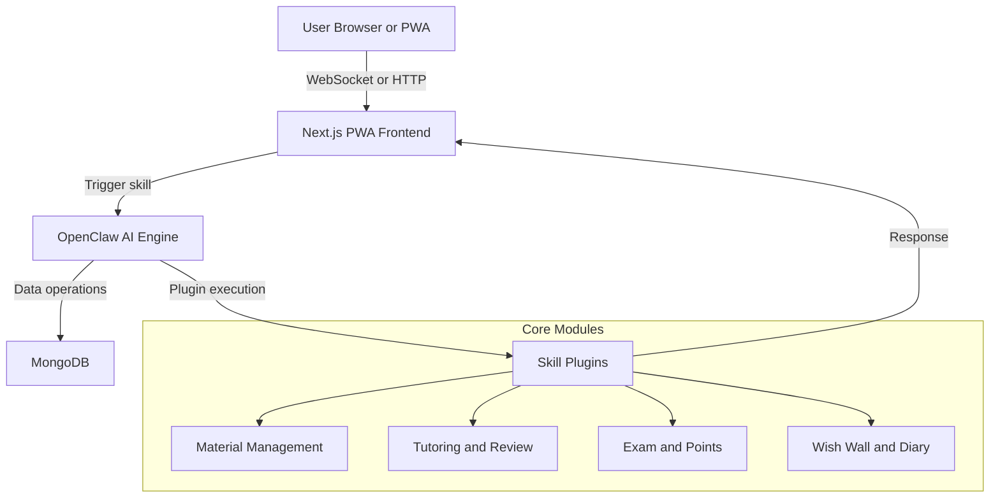

# SmartLearn Claw

SmartLearn Claw is a private-deployable online learning hub for K-12 students.
It uses OpenClaw as the AI-first backend and a Next.js PWA as the user entry.

## Architecture



## Monorepo Layout

```text
smartlearn-claw/
├── docker-compose.yml
├── openclaw-plugins/
│   ├── analyze_material.py
│   ├── tutor_subject.py
│   ├── review_plan.py
│   ├── generate_exam.py
│   ├── award_points.py
│   ├── post_wish.py
│   ├── write_diary.py
│   └── register_plugins.py
└── pwa-frontend/
    ├── public/
    │   ├── manifest.json
    │   └── service-worker.js
    └── src/
        ├── app/
        ├── components/
        └── lib/
```

## Quick Start

1. Copy env file:

```bash
cp .env.example .env
```

2. Start all services:

```bash
docker compose up -d --build
```

3. Open:
- PWA: http://localhost:3000
- OpenClaw API: http://localhost:8000
- MongoDB: mongodb://localhost:27017

## Local Frontend Dev

```bash
cd pwa-frontend
npm install
npm run dev
```

## OpenClaw Plugin Registration

If your OpenClaw runtime requires explicit import, call:

```python
from register_plugins import register_all
register_all()
```

or map this folder to your OpenClaw plugin load path.

## Notes

- This repo intentionally keeps business logic in OpenClaw skills.
- Frontend is a bridge and does not embed core educational rules.
- For production, add JWT auth, role-based ACL, and upload object storage.
# smartlearn-claw
