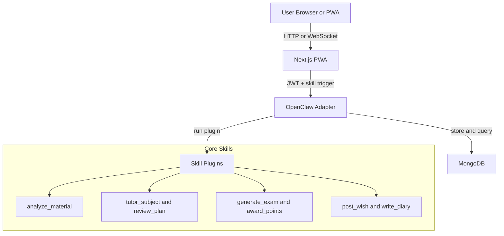

# SmartLearn Claw

SmartLearn Claw is a private-deployable K-12 learning hub with AI-first business logic.

- AI orchestration: OpenClaw adapter + plugin skills
- Frontend entry: Next.js PWA
- Data: MongoDB
- Deployment: Docker Compose

## Architecture



## Monorepo Layout

```text
smartlearn-claw/
├── docker-compose.yml
├── openclaw-adapter/
│   ├── app/main.py
│   └── requirements.txt
├── openclaw-plugins/
│   ├── analyze_material.py
│   ├── tutor_subject.py
│   ├── review_plan.py
│   ├── generate_exam.py
│   ├── award_points.py
│   ├── post_wish.py
│   └── write_diary.py
└── pwa-frontend/
    ├── public/manifest.json
    └── src/app/
```

## One-Command Start

1. Copy env config:

```bash
cp .env.example .env
```

2. Run:

```bash
docker compose up -d --build
```

3. Open:
- PWA: http://localhost:3000
- Adapter health: http://localhost:8000/health

4. Register a student account in the login page, then run full end-to-end checks (upload, tutor, review, exam, points, wish, diary).

## Adapter Endpoints

- `POST /auth/register`
- `POST /auth/login`
- `GET /auth/me`
- `POST /api/upload` (multipart file upload, auth required)
- `POST /api/skills/{skill_name}` (auth required)
- `WS /socket.io` event `trigger_skill` (auth required)

### Example Login Response

```json
{
  "access_token": "<jwt>",
  "token_type": "Bearer",
  "expires_minutes": 10080,
  "user": {
    "user_id": "student-a1b2c3",
    "username": "demo",
    "points": 0,
    "created_at": "2026-03-10T12:00:00+00:00"
  }
}
```

## Security Notes

- JWT is required for HTTP and Socket calls.
- `user_id` is injected server-side from JWT, not trusted from frontend payload.
- Replace `JWT_SECRET` before production deployment.

## Production Suggestions

- Add HTTPS reverse proxy (Nginx/Caddy).
- Move upload storage to object storage.
- Add refresh token and password reset flows.
